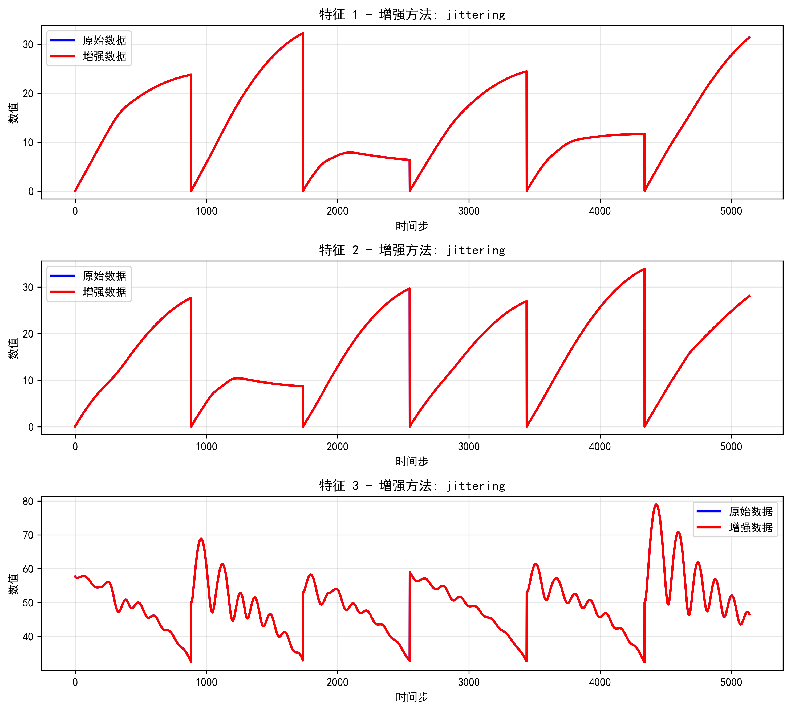
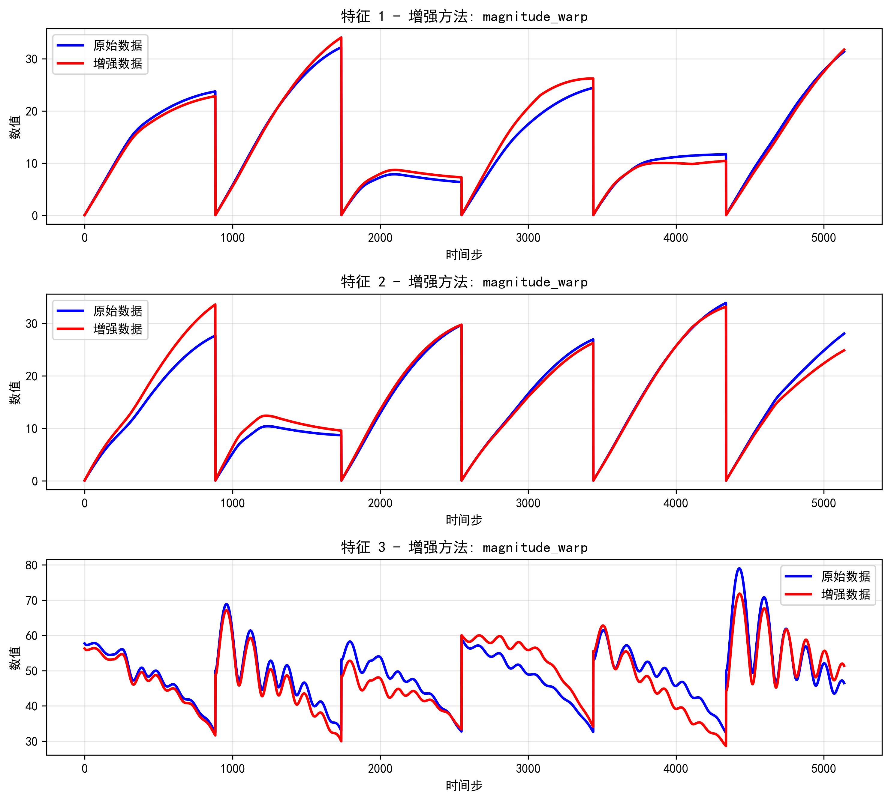
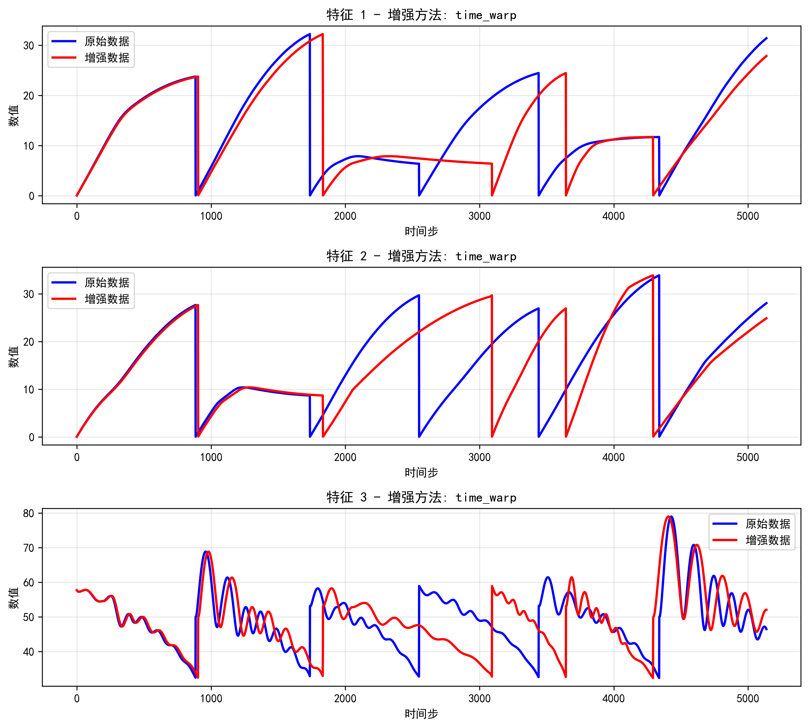
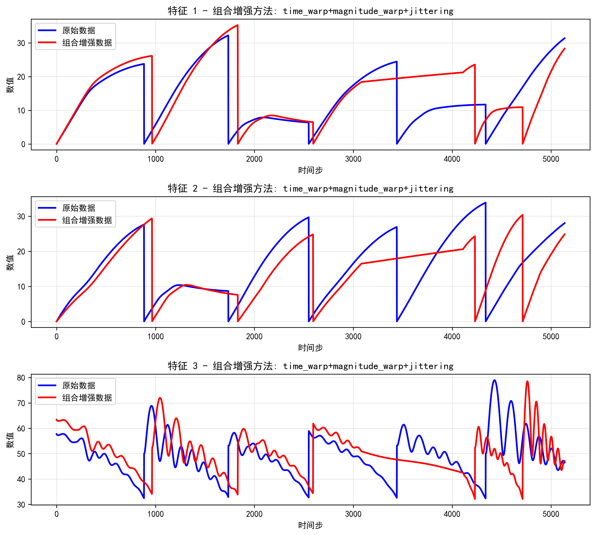

# 数据增强使用指南

## 概述

轨迹数据增强功能，支持以下三种模式：

1. **单独增强模式**：分别应用数据增强方法
2. **组合增强模式**：同时应用K种方法进行组合增强

## 使用方法

### 创建conda环境

```sh
conda create --name data-gan python=3.6.4

conda activate data-gan
```

### 安装依赖

```sh
pip install -r requirement.txt
```

### 使用命令行工具

`配置文件：config.py`

#### 1. 单独增强模式
```bash
python trajectory_augmentation.py --mode individual --visualize
```

#### 2. 组合增强模式
```bash
python trajectory_augmentation.py --mode combined --visualize
```

#### 3. 效果图

##### 3.1 jittering


##### 3.2 magnitude_warp


##### 3.3 time_warp


##### 3.4 combined(jittering + magnitude_warp + time_warp)


## 输出结构

### 单独增强模式输出结构
```
ORIGIN-MAKE-individual/
├── jittering/                   
│   ├── CAV-H-5138_aug_jittering_1.txt
│   ├── CAV-H-5138_jittering_visualization.png
│   ├── CAV-H-10276_aug_jittering_1.txt
│   ├── CAV-H-10276_jittering_visualization.png
│   └── ...
├── magnitude_warp/                    
│   ├── CAV-H-5138_aug_magnitude_warp_1.txt
│   ├── CAV-H-5138_magnitude_warp_visualization.png
│   ├── CAV-H-10276_aug_magnitude_warp_1.txt
│   ├── CAV-H-10276_magnitude_warp_visualization.png
│   └── ...
└── time_warp/       
    ├── CAV-H-5138_aug_time_warp_1.txt
    ├── CAV-H-5138_time_warp_visualization.png
    ├── CAV-H-10276_aug_time_warp_1.txt
    ├── CAV-H-10276_time_warp_visualization.png
    └── ...
```

### 组合增强模式输出结构
```
ORIGIN-MAKE-combine/
    ├── CAV-H-5138_aug_combined_1.txt
    ├── CAV-H-5138_combined_visualization.png
    ├── CAV-H-10276_aug_combined_1.txt
    ├── CAV-H-10276_combined_visualization.png
    └── ...
```

### 可视化文件说明
- `*_time_warp_visualization.png`：时间扭曲增强效果
- `*_magnitude_warp_visualization.png`：幅度扭曲增强效果
- `*_jittering_visualization.png`：抖动增强效果
- `*_combined_visualization.png`：组合增强效果
- `...`

## 参数调整

如果需要调整增强参数，可以修改以下文件中的参数：

### 在 `config.py` 中：

```python
method_params = {
    'time_warp': {'sigma': 0.1, 'knot': 4},
    'magnitude_warp': {'sigma': 0.1, 'knot': 4},
    'jittering': {'sigma': 0.01},
    "time_shift": {"shift_range": (-10, 10)},
    "noise_injection": {"scale": 0.005},
    "random_scaling":{"features_to_scale": None, "min_scale": 0.95, "max_scale": 1.05},
    "window_slice": {"reduce_ratio": 0.95},
    "smoothing": {"window_length": 11, "polyorder": 3},
    "permutation": {"max_segments": 3},
}
```

### 参数说明：
#### 时间扭曲 (time_warp)
- `sigma` (float, 默认: 0.1)：控制时间扭曲的强度，值越大时间轴扭曲越明显
- `knot` (int, 默认: 4)：插值节点数量，影响时间扭曲的平滑度，节点越多扭曲越平滑

#### 幅度扭曲 (magnitude_warp)
- `sigma` (float, 默认: 0.1)：控制幅度扭曲的强度，值越大数值变化越明显
- `knot` (int, 默认: 4)：插值节点数量，影响幅度扭曲的平滑度

#### 抖动增强 (jittering)
- `sigma` (float, 默认: 0.01)：控制添加的高斯噪声标准差，值越大抖动越明显

#### 时间偏移 (time_shift)
- `shift_range` (tuple, 默认: (-10, 10))：时间偏移的范围，单位为时间步长

#### 噪声注入 (noise_injection)
- `scale` (float, 默认: 0.005)：噪声的缩放因子，控制注入噪声的强度

#### 随机缩放 (random_scaling)
- `features_to_scale` (list, 默认: None)：指定需要缩放的特征列，None表示缩放所有特征
- `min_scale` (float, 默认: 0.95)：最小缩放因子
- `max_scale` (float, 默认: 1.05)：最大缩放因子

#### 窗口切片 (window_slice)
- `reduce_ratio` (float, 默认: 0.95)：数据保留比例，0.95表示保留95%的数据

#### 平滑处理 (smoothing)
- `window_length` (int, 默认: 11)：滑动窗口长度，必须为奇数
- `polyorder` (int, 默认: 3)：多项式拟合的阶数，必须小于window_length

#### 排列增强 (permutation)
- `max_segments` (int, 默认: 3)：最大分段数量，控制数据重排的复杂度

## 注意事项

1. 确保输入目录 `ORIGIN` 存在且包含 `.txt` 格式的轨迹文件
2. 输出目录会自动创建
3. 可视化功能需要 matplotlib 库支持
4. 建议使用综合模式以获得最佳效果

## 故障排除

### 常见问题：
1. **找不到输入文件**：检查 `ORIGIN` 目录是否存在且包含 `.txt` 文件
2. **可视化失败**：确保安装了 matplotlib 库
3. **内存不足**：对于大文件，可以调整参数或分批处理
